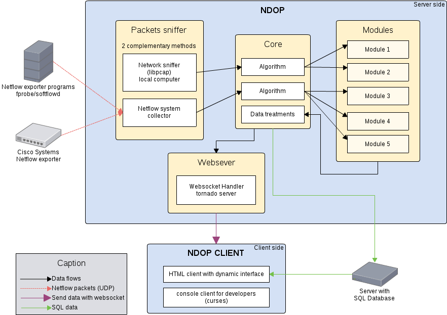

Network-Display-On-Pi
=====================

Network Display On Pi (NDOP) is a network monitoring service which provides you a way to capture packets or flows and send stats by websockets. Packets and flows analysis is done through different modules you can choose or create.

# Repository structure

* ndop : NDOP python server
	* scripts : short cut actions (bash scripts)
	* ndop : python files
* ndop_client : small python client for NDOP server
* www : web client for NDOP server


# NDOP server

## Requirements

* aptitude or apt-get install :
	* python-mysqldb
	* libpcap-dev
	* flow-tools-dev
	* python2.7-dev
	* python-pip

* web download and install :
	* [pypcap 0.6.4](http://sourceforge.net/projects/pylibpcap/)
		* in superuser mode
		* ```cd pylibpcap-*```
		* ```python setup.py install```
	* [psutil 1.0.1 (0.7.1 minimum)](https://code.google.com/p/psutil/)
	* [pyflowtools](https://code.google.com/p/pyflowtools/)

* pip install :
	* tornado
	* argparse
	* importlib


## Installation

Download the git repository or clone it:
```git clone https://github.com/OlivierB/Network-Display-On-Pi.git```

Go in the NDOP server directory :
```cd Network-Display-On-Pi/ndop```


*If you don't want to install NDOP in your system, you can try it with:*
``` ./script/launch_ndop.sh ```

There are two ways to install NDOP :
* basic install with setup.py
	* Command : ```python setup.py install```
		* Add NDOP server in your system
	
* complete install with the *installer* bash script (**Only Linux users**)
	* Command : ``` ./scripts/install_unix.sh ```
		* Add NDOP server in your system
		* Add a config file in ```/etc/ndop/```
		* Add a service script (init.d) and enable service
	

**Do not forget to run these commands in superuser mode**


## Uninstall

In superuser mode :
```
cd ndop
./script/uninstall.sh
```

*uninstall : remove server's config file and service script if they exist*


## Configuration

Configuration file is ```/etc/ndop/server_conf.json``` (**Only with complete install**)

**This config file is written with [JSON](http://en.wikipedia.org/wiki/JSON) syntax**
*Do not forget any coma ! This syntax is very strict.*

If the file doesn't exist, the only way you have to configure NDOP server is to change values in the config file of ndop package (```ndop/config/server_conf.py```). After changes have been made, you need to install it again (or use the launch script ```./script/launch_ndop.sh```).

You can find some samples in ```ndop/doc/sample```

Usefull commands to try different configurations :
* ```ndop -f ndop/doc/sample/sample-full.json```
* ```ndop -f ndop/doc/sample/sample-full.json --test```
* ```ndop -f ndop/doc/sample/sample-full.json --list```

**Some modules doesn't work with netflow or libpcap. You can see a message in the module description (```--list``` option)**


All modules have a default configuration. It is possible to override this configuration in the config file :

```
////////////////////////////
    // Additional module configuration
    // these configs override default module's values

    "modules_config_override": {
        "netmod_bandwidth": {
            "updatetime": 30
        },
        "netmod_protocols": {
            "updatetime": 60,
            "max_live_port": 10,
            "display_port_number" : true
        },
        "netmod_loccomm": {
            "updatetime": 5
        }
    }
```


## Use
* help : ```ndop -h``` (Give you all startup options)

* test config : ```ndop --test``` (tell you if server config works)
* module list : ```ndop --list``` (show modules list and associated variables)
* run in console : ```ndop```
* daemon mode : ```ndop --daemon``` (or use service script ```service ndop start```)
* active debug mode with '-d' option


## How it works ?



### Network sniffing

There are two different ways to sniff network packets and you can use both at the same time:
* pypcap : python implementation of libpcap library (used in tcpdump)
* netflow system : cisco system to create and export network flows

#### Pypcap

This system is embed in NDOP server. You just need to configure listening network interface and add some modules.

```
// Ethernet interface for packets capture
"sniffer_device": "eth0",

// Modules list :
"sniffer_modules_list": [
    // SNIFFER 1 : modules list
    [
        "netmod_top",
        "netmod_iplist",
        "netmod_loccomm",
        "netmod_protocols",
        "netmod_dns",
        "netmod_pktstats"
    ],

    // SNIFFER 2 : modules list
    [
        "netmod_http"
    ]
]
```

**WARNING**
* packets sniffing with libpcap is not optimized for heavy network load
* you cannot listen more than one network interface at the time

But :
* you have a better network live
* you can analyse packet content
* it is possible to work with IPv6 packets

#### Netflow system
netflow system works in two parts :
* exporter which is outside NDOP program. It captures packets and create flows which respects netflow protocol
* collector embed in NDOP program. It listens on the given UDP port to catch sended flows.

##### collector configuration in NDOP

```
// netflow listen port
"flow_listen_port": 9995,

// bind address
"flow_bind_addr": "127.0.0.1",

// Modules list
// uniq list of modules for netflow capture
"flow_mods_list": [
    "netmod_top",
    "netmod_iplist",
    "netmod_loccomm",
    "netmod_protocols",
    "netmod_dns",
    "netmod_pktstats",
    "netmod_bandwidth"
]
```

You can bind all interfaces with : ```"flow_bind_addr": ""```

##### Export configuration

You need to use programs like :
* fprobe
* softflowd

You can install these programs with ```aptitide``` or ```apt-get```

fprobe config sample (```/etc/default/fprobe```)

```
#fprobe default configuration file

INTERFACE="eth1"
FLOW_COLLECTOR="127.0.0.1:9995"

#fprobe can't distinguish IP packet from other (e.g. ARP)
OTHER_ARGS="-fip -e5"
```
* -e parameter is the maximun packets flow length in second
* With -e5 parameter, capture seems to be like live capture
* If you have heavy network load, use -e30 or more.

```-fip``` is a packets filter. It means that exporter program will only capture IP packets. 


### Modules

#### What is a module ?

Create a Module system is the way we have chosen to allow easy NDOP evolution. We provide you a set of functions which are automaticaly called by the core algorithme. You need to implement these functions and change default module's parameters if necessary.

All modules inherit from ```NetModule``` in order to match all functions. You have to override functions you need.


#### Module description

##### Functions

A module have two entry points :

* ```pkt_handler``` for simple packet capture with libpcap
* ```flow_handler``` for packets flow capture

**In a running NDOP server, you can use only one of these functions. ```pkt_handler``` and ```flow_handler``` functions are called respectively if module is in ```sniffer_modules_list``` or ```flow_mods_list``` list**


There are two bdd functions :
* ```database_init``` called every time NDOP server is started to create tables if needed
* ```database_save``` calles every ```savecode``` to save data in BDD

One function for websocket:
* ```update``` called every ```updatetime```. **You have to return a dictionary**

##### Special functions

Init function have to be implement to define some variables

```
def __init__(self, *args, **kwargs):
    NetModule.__init__(self, updatetime=5, savecode=('m', 30), protocol='skeleton', savebdd=True, *args, **kwargs)

```

If you want to give access to module's variables through cofiguration file, use ```add_conf_override``` with the variable name (string)


##### Parameters

List of default available parameters :
* updatetime : time in second between each ```update``` call
* savecode : time between each ```database_save``` call
	* format : ("m", 10) or ["m", 10]
		* first param is "m" or "h" for minutes and hours
		* second param is 60 divisor or 24 divisor depending if it is minutes or hours
	* default is ("m", 30) : save every 30 minutes (means 1H00, 1H30, 2H00, 2H30, ...)
* protocol : string representing module name
	* this name is used to recognize and connect with websocket
* savebdd : enebled or disabled BDD save for this module


#### Add a new module

create a new python file in ```ndop/modules``` with skeleton module :
* ```cd ndop/modules/```
* ```cp netmod_skeleton.py netmod_mymodule.py```
* Change protocol in ```__init___``` function


# python NDOP client

## Installation

* aptitude install
	* libevent-dev

* pip install
	* argparse
	* [websocket](https://pypi.python.org/pypi/websocket-client/0.7.0)
* doc : [python-curses](http://docs.python.org/2/howto/curses.html)


Installation Commands:
```
cd ndop_client
python setup.py install
```

You can also use bash install script:
```
./install_unix.sh
```

## Utilization

If your server is on the same computer, you just need to run (default ndop-client bind address is 127.0.0.1:9000) :
```
cd ndop_client
python client
```

otherwise, configure address correctly with ```--addr``` option
```
python client --addr ADDRESS:PORT
```

# Integrated web client

## Requirements

* web server :
	* Apache
		* htaccess activated
		* rewrite module (a2enmod)
	* Php 5
		* PDO activated
	* Mysql

* optional installation
	* Freegeoip : You can use the www.freegeoip.net free website but the number of request per day is limited, you might want to install your own server. It's free and quite easy. Go to https://github.com/fiorix/freegeoip.
	* Snort : You can use the snort IDS to display alerts from the network. If you want to use the Snort widget, you have to [install it](http://openmaniak.com/snort_tutorial_snort.php#ancre-point2).


## Installation

Download the git repository or clone it:
```git clone https://github.com/OlivierB/Network-Display-On-Pi.git```

Put the www/ folder into your Apache directory or change your Apache configuration to bind it to the www/ folder:
```mv www/ /var/www/ndop/```

You will probably need to change the owner of this folder. By default Apache is running under www-data user and group.
```chown -R www-data /var/www/ndop/```

Go to the URL corresponding to the location you chose in your browser. You should see a page telling you to go to the administration page. You can now follow instructions given on the website.


## Uninstall

If you want to erase the NDOP GUI from your system you can erase the folder you created during the installation (/var/www/ndop/ in the example). You should also erase the database, its name is NDOP_GUI.

## Configure an optimized displaying computer

### Note about computer
NDOP has been designed to be dispayed with a raspberry PI, but any computer can access it thanks to a simple web browser.
If you want to use a raspberry PI, the simple way to create an NDOP system is to follow the instructions below after installing Raspbian OS.

### Install :
- openbox
- chromium or google chrome
- unclutter (optional mouse hider)
- sakura (optional good and light terminal ;)

### openbox configuration :
* create file ~/.config/openbox/autostart
* write (Replace the DOMAIN value by the ip or domain name of the NDOP webserver host. Replace the end of ADDR by the path you use to access the NDOP website, for example : DOMAIN=192.168.1.144 and ADDR="http://${DOMAIN}/Network-Display-On-Pi/www/". ):

```
# Address of your NDOP webserver
DOMAIN=192.168.1.151
ADDR="http://${DOMAIN}/Network-Display-On-Pi/www/"


while true
do
	ping -c 1 $DOMAIN
	if [ $? -eq 0 ];
	then
		echo 'Network available.'
		break;
	else
		echo 'Address unreachable, waiting..'
		sleep 5
	fi
done
echo 'If you see this message, then Network was successfully loaded.'

xset -dpms &
xset s noblank &
xset s off &
sakura &

~/browser.sh $ADDR
```

To make openbox your default window manager, run this command line and follow the instructions:

```
update-alternatives --config x-session-manager
```

On Raspberry PI, you can set your configuration to start the GUI on boot by running the following command and following the instructions:
```
raspi-config
```

### browser script
Create the file ~/browser.sh and paste this small script to launch chromium at start on the NDOP page. You can replace chromium by google-chrome if you want, but google-chrome can't be installed on raspberry PI.
```
#!/bin/bash
while [ $# -gt 0 ]; do
	chromium --kiosk --incognito --no-context-menu --enable-logging --log-level=0 $1 2> /dev/null 1> /dev/null &
	shift
done
```

### Finished
Now you can restart your computer and see the NDOP page after the boot!!

If there is a problem, it could be interesting to see google-chrome logs :
```
tail -f ~/.config/google-chrome/chrome_debug.log
```
